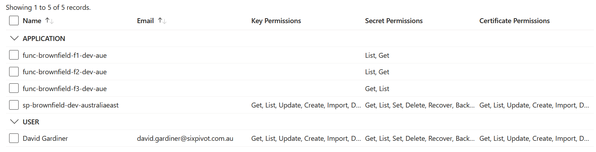

# Key Vault

````md magic-move {lines: true}

<!-- Original exported HCL -->
```hcl {*}
import {
  id = "/subscriptions/00000000-0000-0000-0000-000000000000/resourceGroups/
    rg-brownfield-dev-australiaeast/providers/Microsoft.KeyVault/vaults/kv-bf-dev-je7v-aue"
  to = azurerm_key_vault.res-3
}

resource "azurerm_key_vault" "res-3" {
  location                   = "australiaeast"
  name                       = "kv-bf-dev-je7v-aue"
  resource_group_name        = "rg-brownfield-dev-australiaeast"
  sku_name                   = "standard"
  soft_delete_retention_days = 7
  tenant_id                  = "51b792d5-bfd3-4dbd-82d2-f42aef2fa7ee"
}
```

<!-- Use data resource references -->
```hcl {*}
import {
  id = "/subscriptions/${data.azurerm_client_config.client.subscription_id}/resourceGroups/
    ${data.azurerm_resource_group.group.name}/providers/Microsoft.KeyVault/vaults/kv-bf-dev-je7v-aue"
  to = azurerm_key_vault.res-3
}

resource "azurerm_key_vault" "res-3" {
  location                   = data.azurerm_resource_group.group.location
  name                       = "kv-bf-dev-je7v-aue"
  resource_group_name        = data.azurerm_resource_group.group.name
  sku_name                   = "standard"
  soft_delete_retention_days = 7
  tenant_id                  = data.azurerm_client_config.client.tenant_id
}
```

<!-- Add locals for KV names -->
```hcl {*}
locals {
  key_vault_name = {
    dev  = "kv-bf-dev-je7v-aue"
    test = "kv-bf-test-u48x-aue"
    prod = "kv-bf-prod-je7v-aue"
  }
}

import {
  id = "/subscriptions/${data.azurerm_client_config.client.subscription_id}/resourceGroups/
    ${data.azurerm_resource_group.group.name}/providers/Microsoft.KeyVault/vaults/${local.key_vault_name[var.environment]}"
  to = azurerm_key_vault.res-3
}

resource "azurerm_key_vault" "res-3" {
  location                   = data.azurerm_resource_group.group.location
  name                       = local.key_vault_name[var.environment]
  resource_group_name        = data.azurerm_resource_group.group.name
  sku_name                   = "standard"
  soft_delete_retention_days = 7
  tenant_id                  = data.azurerm_client_config.client.tenant_id
}
```

<!-- resource names -->
```hcl {*}
locals {
  key_vault_name = {
    dev  = "kv-bf-dev-je7v-aue"
    test = "kv-bf-test-u48x-aue"
    prod = "kv-bf-prod-je7v-aue"
  }
}

import {
  id = "/subscriptions/${data.azurerm_client_config.client.subscription_id}/resourceGroups/
    ${data.azurerm_resource_group.group.name}/providers/Microsoft.KeyVault/vaults/${local.key_vault_name[var.environment]}"
  to = azurerm_key_vault.kv
}

resource "azurerm_key_vault" "kv" {
  location                   = data.azurerm_resource_group.group.location
  name                       = local.key_vault_name[var.environment]
  resource_group_name        = data.azurerm_resource_group.group.name
  sku_name                   = "standard"
  soft_delete_retention_days = 7
  tenant_id                  = data.azurerm_client_config.client.tenant_id
}
```


````

<!-- 
* Original
* Data resources
* KV names
* resource names
-->

---

# Output

```text {*}{maxHeight: '80%' }
Terraform will perform the following actions:

  # azurerm_key_vault.kv will be imported
    resource "azurerm_key_vault" "kv" {
        access_policy                   = [
            {
                application_id          = null
                certificate_permissions = [
                    "all",
                ]
                key_permissions         = [
                    "all",
                ]
                object_id               = "df956735-e715-48f7-80bd-9d371298614d"
                secret_permissions      = [
                    "all",
                ]
                storage_permissions     = [
                    "all",
                ]
                tenant_id               = "51b792d5-bfd3-4dbd-82d2-f42aef2fa7ee"
            },
            {
                application_id          = null
                certificate_permissions = []
                key_permissions         = []
                object_id               = "463e0df6-c77a-4977-9191-78ab9a27011d"
                secret_permissions      = [
                    "List",
                    "Get",
                ]
                storage_permissions     = []
                tenant_id               = "51b792d5-bfd3-4dbd-82d2-f42aef2fa7ee"
            },
            {
                application_id          = null
                certificate_permissions = []
                key_permissions         = []
                object_id               = "88016e7a-c8ee-43c1-bd3c-d6c4ff2530c0"
                secret_permissions      = [
                    "List",
                    "Get",
                ]
                storage_permissions     = []
                tenant_id               = "51b792d5-bfd3-4dbd-82d2-f42aef2fa7ee"
            },
            {
                application_id          = null
                certificate_permissions = []
                key_permissions         = []
                object_id               = "20465cbf-884a-42a6-a1e8-1212a28859c0"
                secret_permissions      = [
                    "Get",
                    "List",
                ]
                storage_permissions     = []
                tenant_id               = "51b792d5-bfd3-4dbd-82d2-f42aef2fa7ee"
            },
            {
                application_id          = null
                certificate_permissions = [
                    "all",
                ]
                key_permissions         = [
                    "all",
                ]
                object_id               = "1b31b7c8-2237-43ae-8969-7a4332bcde03"
                secret_permissions      = [
                    "all",
                ]
                storage_permissions     = [
                    "all",
                ]
                tenant_id               = "51b792d5-bfd3-4dbd-82d2-f42aef2fa7ee"
            },
        ]
        enable_rbac_authorization       = false
        enabled_for_deployment          = false
        enabled_for_disk_encryption     = false
        enabled_for_template_deployment = false
        id                              = "/subscriptions/00000000-0000-0000-0000-000000000000/resourceGroups/rg-brownfield-dev-australiaeast/providers/Microsoft.KeyVault/vaults/kv-bf-dev-je7v-aue"
        location                        = "australiaeast"
        name                            = "kv-bf-dev-je7v-aue"
        public_network_access_enabled   = true
        purge_protection_enabled        = false
        resource_group_name             = "rg-brownfield-dev-australiaeast"
        sku_name                        = "standard"
        soft_delete_retention_days      = 7
        tags                            = {}
        tenant_id                       = "51b792d5-bfd3-4dbd-82d2-f42aef2fa7ee"
        vault_uri                       = "https://kv-bf-dev-je7v-aue.vault.azure.net/"

        network_acls {
            bypass                     = "AzureServices"
            default_action             = "Allow"
            ip_rules                   = []
            virtual_network_subnet_ids = []
        }
    }
```

<!--
* Access policies are included, which still need to be done.
-->

---

# Key Vault access policies

* Not included in `aztfexport` output
* Need to add manually



---

# Key Vault access policy import

Import notes for `azurerm_key_vault_access_policy`

<QRCode value="https://registry.terraform.io/providers/hashicorp/azurerm/latest/docs/resources/key_vault_access_policy" bottomAdjust="0px" />

```hcl
resource "azurerm_key_vault_access_policy" "pipeline_spn" {
  key_vault_id            = azurerm_key_vault.kv.id
  tenant_id               = data.azurerm_client_config.current.tenant_id
  object_id               = data.azurerm_client_config.current.object_id
  certificate_permissions = [ "all" ]
  secret_permissions      = [ "all" ]
  key_permissions         = [ "all" ]
  storage_permissions     = [ "all" ]
}
```

---
layout: problem
---

# Error

expected certificate_permissions.0 to be one of ["Get" "List" "Update" "Create" "Import" "Delete" "Recover" "Backup" "Restore" "ManageContacts" "ManageIssuers" "GetIssuers" "ListIssuers" "SetIssuers" "DeleteIssuers" "Purge"], got all

expected secret_permissions.0 to be one of ["Get" "List" "Set" "Delete" "Recover" "Backup" "Restore" "Purge"], got all

expected key_permissions.0 to be one of ["Get" "List" "Update" "Create" "Import" "Delete" "Recover" "Backup" "Restore" "Decrypt" "Encrypt" "UnwrapKey" "WrapKey" "Verify" "Sign" "Purge" "Release" "Rotate" "GetRotationPolicy" "SetRotationPolicy"], got all

expected storage_permissions.0 to be one of ["Backup" "Delete" "DeleteSAS" "Get" "GetSAS" "List" "ListSAS" "Purge" "Recover" "RegenerateKey" "Restore" "Set" "SetSAS" "Update"], got all

---

# Access policy for pipeline SPN

````md magic-move {lines: true}

```hcl {5-8}
resource "azurerm_key_vault_access_policy" "pipeline_spn" {
  key_vault_id            = azurerm_key_vault.kv.id
  tenant_id               = data.azurerm_client_config.current.tenant_id
  object_id               = data.azurerm_client_config.current.object_id
  certificate_permissions = ["Get", "List", "Update", "Create", "Import", "Delete", "Recover", "Backup", "Restore", "ManageContacts", "ManageIssuers", "GetIssuers", "ListIssuers", "SetIssuers", "DeleteIssuers", "Purge"]
  secret_permissions      = ["Get", "List", "Set", "Delete", "Recover", "Backup", "Restore", "Purge"]
  key_permissions         = ["Get", "List", "Update", "Create", "Import", "Delete", "Recover", "Backup", "Restore", "Decrypt", "Encrypt", "UnwrapKey", "WrapKey", "Verify", "Sign", "Purge", "Release", "Rotate", "GetRotationPolicy", "SetRotationPolicy"]
  storage_permissions     = ["Backup", "Delete", "DeleteSAS", "Get", "GetSAS", "List", "ListSAS", "Purge", "Recover", "RegenerateKey", "Restore", "Set", "SetSAS", "Update"]
}
```

```hcl {1-4|*}
import {
  id = "${azurerm_key_vault.kv.id}/objectId/${data.azurerm_client_config.current.object_id}"
  to = azurerm_key_vault_access_policy.pipeline_spn
}

resource "azurerm_key_vault_access_policy" "pipeline_spn" {
  key_vault_id            = azurerm_key_vault.kv.id
  tenant_id               = data.azurerm_client_config.current.tenant_id
  object_id               = data.azurerm_client_config.current.object_id
  certificate_permissions = ["Get", "List", "Update", "Create", "Import", "Delete", "Recover", "Backup", "Restore", "ManageContacts", "ManageIssuers", "GetIssuers", "ListIssuers", "SetIssuers", "DeleteIssuers", "Purge"]
  secret_permissions      = ["Get", "List", "Set", "Delete", "Recover", "Backup", "Restore", "Purge"]
  key_permissions         = ["Get", "List", "Update", "Create", "Import", "Delete", "Recover", "Backup", "Restore", "Decrypt", "Encrypt", "UnwrapKey", "WrapKey", "Verify", "Sign", "Purge", "Release", "Rotate", "GetRotationPolicy", "SetRotationPolicy"]
  storage_permissions     = ["Backup", "Delete", "DeleteSAS", "Get", "GetSAS", "List", "ListSAS", "Purge", "Recover", "RegenerateKey", "Restore", "Set", "SetSAS", "Update"]
}

```

````

---
layout: problem
---

# But it doesn't exist in Test!

```text
Error: Cannot import non-existent remote object

While attempting to import an existing object to
"azurerm_key_vault_access_policy.pipeline_spn", the provider detected that no
object exists with the given id. Only pre-existing objects can be imported;
check that the id is correct and that it is associated with the provider's
configured region or endpoint, or use "terraform apply" to create a new
remote object for this resource.
```

---

# So make that import conditional too

````md magic-move {lines: true}

```hcl {*}
import {
  id = "${azurerm_key_vault.kv.id}/objectId/${data.azurerm_client_config.current.object_id}"
  to = azurerm_key_vault_access_policy.pipeline_spn
}

resource "azurerm_key_vault_access_policy" "pipeline_spn" {
  key_vault_id            = azurerm_key_vault.kv.id
  tenant_id               = data.azurerm_client_config.current.tenant_id
  object_id               = data.azurerm_client_config.current.object_id
  ...
}

```

```hcl {2-5|11|7|*}
import {
  for_each = contains(["dev", "prod"], var.environment) ? {
    enabled = true
    } : {
  }
  id = "${azurerm_key_vault.kv.id}/objectId/${data.azurerm_client_config.current.object_id}"
  to = azurerm_key_vault_access_policy.pipeline_spn[0]
}

resource "azurerm_key_vault_access_policy" "pipeline_spn" {
  count = contains(["dev", "prod"], var.environment) ? 1 : 0

  key_vault_id            = azurerm_key_vault.kv.id
  tenant_id               = data.azurerm_client_config.current.tenant_id
  object_id               = data.azurerm_client_config.current.object_id
  ...
}
```

````

---

# Did it work?

```text {14|101-124|106}{maxHeight: '80%' }
Terraform will perform the following actions:

  # azurerm_key_vault.kv will be imported
    resource "azurerm_key_vault" "kv" {
        access_policy                   = [
            {
                application_id          = null
                certificate_permissions = [
                    "all",
                ]
                key_permissions         = [
                    "all",
                ]
                object_id               = "df956735-e715-48f7-80bd-9d371298614d"
                secret_permissions      = [
                    "all",
                ]
                storage_permissions     = [
                    "all",
                ]
                tenant_id               = "51b792d5-bfd3-4dbd-82d2-f42aef2fa7ee"
            },
            {
                application_id          = null
                certificate_permissions = []
                key_permissions         = []
                object_id               = "463e0df6-c77a-4977-9191-78ab9a27011d"
                secret_permissions      = [
                    "List",
                    "Get",
                ]
                storage_permissions     = []
                tenant_id               = "51b792d5-bfd3-4dbd-82d2-f42aef2fa7ee"
            },
            {
                application_id          = null
                certificate_permissions = []
                key_permissions         = []
                object_id               = "88016e7a-c8ee-43c1-bd3c-d6c4ff2530c0"
                secret_permissions      = [
                    "List",
                    "Get",
                ]
                storage_permissions     = []
                tenant_id               = "51b792d5-bfd3-4dbd-82d2-f42aef2fa7ee"
            },
            {
                application_id          = null
                certificate_permissions = []
                key_permissions         = []
                object_id               = "20465cbf-884a-42a6-a1e8-1212a28859c0"
                secret_permissions      = [
                    "Get",
                    "List",
                ]
                storage_permissions     = []
                tenant_id               = "51b792d5-bfd3-4dbd-82d2-f42aef2fa7ee"
            },
            {
                application_id          = null
                certificate_permissions = [
                    "all",
                ]
                key_permissions         = [
                    "all",
                ]
                object_id               = "1b31b7c8-2237-43ae-8969-7a4332bcde03"
                secret_permissions      = [
                    "all",
                ]
                storage_permissions     = [
                    "all",
                ]
                tenant_id               = "51b792d5-bfd3-4dbd-82d2-f42aef2fa7ee"
            },
        ]
        enable_rbac_authorization       = false
        enabled_for_deployment          = false
        enabled_for_disk_encryption     = false
        enabled_for_template_deployment = false
        id                              = "/subscriptions/00000000-0000-0000-0000-000000000000/resourceGroups/rg-brownfield-dev-australiaeast/providers/Microsoft.KeyVault/vaults/kv-bf-dev-je7v-aue"
        location                        = "australiaeast"
        name                            = "kv-bf-dev-je7v-aue"
        public_network_access_enabled   = true
        purge_protection_enabled        = false
        resource_group_name             = "rg-brownfield-dev-australiaeast"
        sku_name                        = "standard"
        soft_delete_retention_days      = 7
        tags                            = {}
        tenant_id                       = "51b792d5-bfd3-4dbd-82d2-f42aef2fa7ee"
        vault_uri                       = "https://kv-bf-dev-je7v-aue.vault.azure.net/"

        network_acls {
            bypass                     = "AzureServices"
            default_action             = "Allow"
            ip_rules                   = []
            virtual_network_subnet_ids = []
        }
    }

  # azurerm_key_vault_access_policy.pipeline_spn[0] will be updated in-place
  # (imported from "/subscriptions/00000000-0000-0000-0000-000000000000/resourceGroups/rg-brownfield-dev-australiaeast/providers/Microsoft.KeyVault/vaults/kv-bf-dev-je7v-aue/objectId/df956735-e715-48f7-80bd-9d371298614d")
  ~ resource "azurerm_key_vault_access_policy" "pipeline_spn" {
        application_id          = null
      ~ certificate_permissions = [
          - "all",
          + "Get",
          + "List",
          + "Update",
          + "Create",
          + "Import",
          + "Delete",
          + "Recover",
          + "Backup",
          + "Restore",
          + "ManageContacts",
          + "ManageIssuers",
          + "GetIssuers",
          + "ListIssuers",
          + "SetIssuers",
          + "DeleteIssuers",
          + "Purge",
        ]
        id                      = "/subscriptions/00000000-0000-0000-0000-000000000000/resourceGroups/rg-brownfield-dev-australiaeast/providers/Microsoft.KeyVault/vaults/kv-bf-dev-je7v-aue/objectId/df956735-e715-48f7-80bd-9d371298614d"
      ~ key_permissions         = [
          - "all",
          + "Get",
          + "List",
          + "Update",
          + "Create",
          + "Import",
          + "Delete",
          + "Recover",
          + "Backup",
          + "Restore",
          + "Decrypt",
          + "Encrypt",
          + "UnwrapKey",
          + "WrapKey",
          + "Verify",
          + "Sign",
          + "Purge",
          + "Release",
          + "Rotate",
          + "GetRotationPolicy",
          + "SetRotationPolicy",
        ]
        key_vault_id            = "/subscriptions/00000000-0000-0000-0000-000000000000/resourceGroups/rg-brownfield-dev-australiaeast/providers/Microsoft.KeyVault/vaults/kv-bf-dev-je7v-aue"
        object_id               = "df956735-e715-48f7-80bd-9d371298614d"
      ~ secret_permissions      = [
          - "all",
          + "Get",
          + "List",
          + "Set",
          + "Delete",
          + "Recover",
          + "Backup",
          + "Restore",
          + "Purge",
        ]
      ~ storage_permissions     = [
          - "all",
          + "Backup",
          + "Delete",
          + "DeleteSAS",
          + "Get",
          + "GetSAS",
          + "List",
          + "ListSAS",
          + "Purge",
          + "Recover",
          + "RegenerateKey",
          + "Restore",
          + "Set",
          + "SetSAS",
          + "Update",
        ]
        tenant_id               = "51b792d5-bfd3-4dbd-82d2-f42aef2fa7ee"
    }
```

---

# Add remaining access policies
